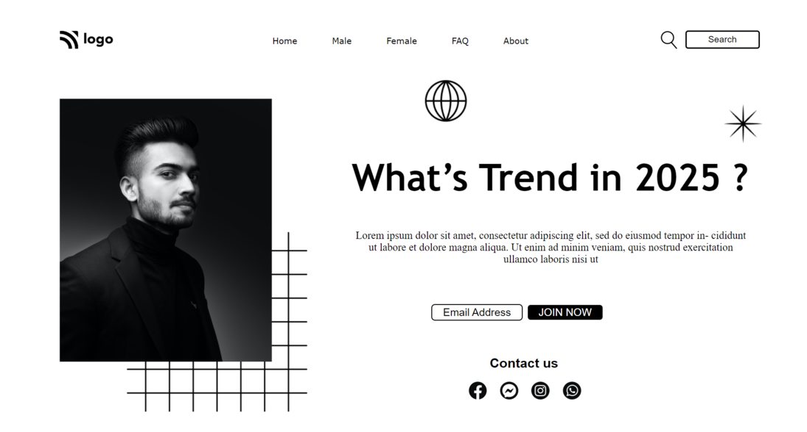

# Actor Website

This was the first project and it only comprised of HTML and CSS.
There's no responsive design for the page, so most of the arrangement has been done through `position` in CSS.
 
 

***

 

## Navbar (Hover)

The navbar links have been coded to change properties on hovering.
 
 
